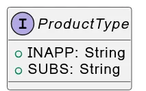
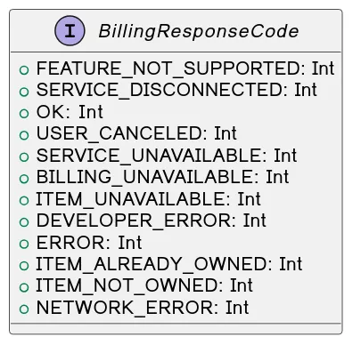
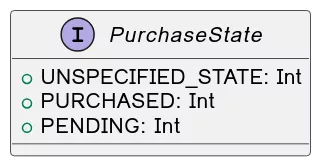
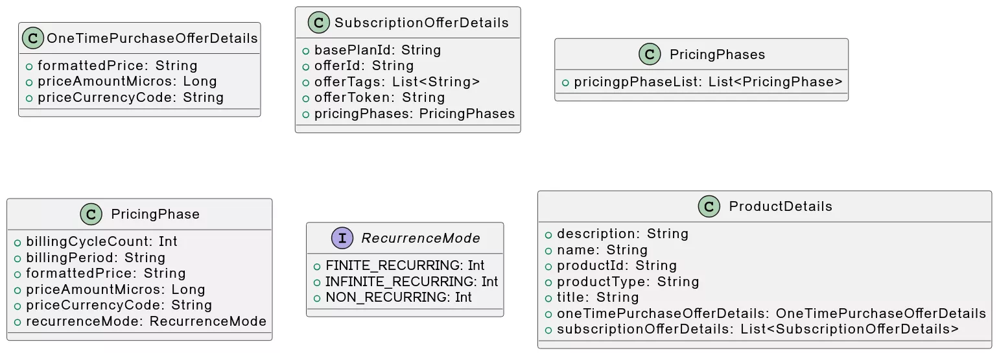
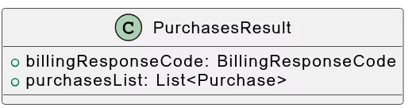

# P {WIP} Generic FAA Payment Solution \_ In App SDK v2 020524 144022

### {WIP} Generic FAA Payment Solution > In-App SDK v2

Data Models

ProductType FeatureType

BillingResponseCode PurchaseState

ProductDetails

OneTimePurchaseOffer ProductDetailsResult

Purchase

PurchasesResult Features

Connect to Billing client

Add the In-App SDK dependency Initialise BillingClient

Connect Payments API Validate supported features Fetching product details Fetching purchases Launch the billing flow

Acknowledging purchases Non-Consumables

Consumables

Verifying purchase integrity

### Data Models

### ProductType

Supported Product types.

Subscriptions are currently not supported.

### FeatureType

Features/capabilities supported by isFeaturedAvailable.

| ALTERNATIVE\_BILLING\_ONLY  | Alternative billing only.                         |
| --------------------------- | ------------------------------------------------- |
| BILLING\_CONFIG             | Get billing config.                               |
| IN\_APP\_MESSAGING          | Show in-app messages.                             |
| PRICE\_CHANGE\_CONFIRMATION | Launch a price change confirmation flow.          |
| PRODUCT\_DETAILS            | Support for querying and purchasing in-app items. |
| SUBSCRIPTIONS               | Purchase/query for subscriptions.                 |
| SUBSCRIPTIONS\_UPDATE       | Subscriptions update/replace.                     |

### BillingResponseCode

Possible response codes.

| **Property**            | **Description**                                                                 |
| ----------------------- | ------------------------------------------------------------------------------- |
| FEATURE\_NOT\_SUPPORTED | The requested feature is not supported by the Play Store on the current device. |
| SERVICE\_DISCONNECTED   | The app is not connected to FAA’s Payment.                                      |
| OK                      | Success.                                                                        |
| USER\_CANCELED          | Transaction was canceled by the user.                                           |
| SERVICE\_UNAVAILABLE    | The service is currently unavailable.                                           |
| BILLING\_UNAVAILABLE    | A user billing error occurred during processing.                                |
| ITEM\_UNAVAILABLE       | The requested product is not available for purchase.                            |
| DEVELOPER\_ERROR        | Error resulting from incorrect usage of the API.                                |
| ERROR                   | Fatal error during the API action.                                              |
| ITEM\_ALREADY\_OWNED    | The purchase failed because the item is already owned.                          |
| ITEM\_NOT\_OWNED        | Requested action on the item failed since it is not owned by the user.          |
| NETWORK\_ERROR          | A network error occurred during the operation.                                  |

### PurchaseState

Possible purchase states.

| **Value**          | **Description**                                    |
| ------------------ | -------------------------------------------------- |
| UNSPECIFIED\_STATE | Represents an unspecified state of a purchase.     |
| PURCHASED          | Indicates that the purchase has been completed.    |
| PENDING            | Indicates that the purchase is pending completion. |

### ProductDetails

Represents the details of a one time or subscription product.

| **Property**                | **Description**                                                                                                               |
| --------------------------- | ----------------------------------------------------------------------------------------------------------------------------- |
| description                 | Returns the description of the product.                                                                                       |
| name                        | Returns the name of the product being sold.                                                                                   |
| productId                   | Returns the product's Id.                                                                                                     |
| productType                 | Returns the [ProductType ](https://faurecia-aptoide.atlassian.net/wiki/spaces/P/pages/2571304998#ProductTypes)of the product. |
| title                       | Returns the title of the product being sold.                                                                                  |
| oneTimePurchaseOfferDetails | Returns the offer details of an one-time purchase product.                                                                    |
| subscriptionOfferDetails    | Returns a list containing all available offers to purchase a subscription product.                                            |

#### OneTimePurchaseOffer

| **Property**      | **Description**                                                                                               |
| ----------------- | ------------------------------------------------------------------------------------------------------------- |
| formattedPrice    | Returns formatted price for the payment, including its currency sign.                                         |
| priceAmountMicros | Returns the price for the payment in micro-units, where 1,000,000 micro-units equal one unit of the currency. |
| priceCurrencyCode | Returns ISO 4217 currency code for price.                                                                     |

**ProductDetailsResult**

### Purchase

Represents an in-app billing purchase.

| **Property**       | **Description**                                                                            |
| ------------------ | ------------------------------------------------------------------------------------------ |
| products           | Returns the product Ids.                                                                   |
| purchaseState      | Returns one of Purchase.PurchaseState indicating the state of the purchase.                |
| purchaseTime       | Returns the time the product was purchased, in milliseconds since the epoch (Jan 1, 1970). |
| purchaseToken      | A token that uniquely identifies a purchase for a given item and user pair.                |
| accountIdentifiers | Returns account identifiers that were provided when the purchase was made.                 |
| developerPayload   | Returns the payload specified when the purchase was acknowledged or consumed.              |

| isAcknowledged | Indicates whether the purchase has been acknowledged.                                                                                                                                  |
| -------------- | -------------------------------------------------------------------------------------------------------------------------------------------------------------------------------------- |
| isAutoRenewing | Indicates whether the subscription renews automatically.                                                                                                                               |
| orderId        | 
Returns a unique order identifier for the transaction.

This identifier corresponds to the order ID.
                                                                       |
| originalJson   | Returns a String in JSON format that contains details about the purchase order.                                                                                                        |
| packageName    | Returns the application package from which the purchase originated.                                                                                                                    |
| quantity       | Returns the quantity of the purchased product.                                                                                                                                         |
| signature      | 
Returns String containing the signature of the purchase data that was signed with the private key of the developer. The data signature uses the

RSASSA-PKCS1-v1_5 scheme.
 |

**accountIdentifiers** are currently not returned.

#### PurchasesResult

Result list and response code for **queryPurchases** method.

### Features

### Connect to Billing client

**Add the In-App SDK dependency**

Add the In-App SDK dependency in your app’s file as shown:

build.grade

1

2

3

4

5

dependencies {

**def** inapp\_version = "2.0.2"

implementation "com.faa.billingclient:InApp-SDK:$inapp\_version"

}

**Initialise BillingClient**

After adding the In-App SDK dependency, a

BillingClient

instance needs to be created.

is the entry point to accessing

the In-App SDK features. It offers convenience methods that cover many common tasks associated with billing.

BillingClient

is used to configure and create instance tailored to the needs of your app, as well as for

BillingClient.Builder()

BillingClient

injecting dependencies of In-App SDK. It is required that the following parameters are passed to BillingClient.Builder :

\- application context used to access application specific resources

context

\- Sets the listener through which notifications for purchases updates will be propagated to.

purchaseUpdateListener

1. val billingClientSettings = BillingClientSettings.Builder()
2. .setContext(context)
3. .setPurchasesUpdatedListener(purchasesUpdatedListener)
4. .build()
5. billingClient = BillingClient(billingClientSettings)

In addition to these parameters, you can also set for the billing client to start operating in tester mode.

testMode is not currently supported.

**Connect Payments API**

testMode

Once you’ve instantiated the BillingClient , you need to establish a connection with the Payments Module (which can be Service or part

of another App). Call to connect to the Payments Module. The connection establishment process may take several

startConnection()

seconds. In order to be notified of connection state changes, i.e., if the connection was established or lost and to react accordingly, it is necessary to provide an implementation of BillingClientStateListener :

1. billingClient.startConnection(**object** : BillingClientStateListener {
2. **override fun** onBillingSetupFinished(billingResponseCode: BillingResponseCode) {
3. **if** (billingResponseCode.responseCode == BillingResponseCode.OK) {
4. _// The BillingClient is ready. You can query purchases here._

5 }

6 }

1. **override fun** onBillingServiceDisconnected() {
2. _// Try to restart the connection on the next request to_
3. _// FAA Payments'system by calling the startConnection() method._

10 }

11 })

It may happen that the billing client fails to connect or loses connection to the Payments Module, in which case you can retry the connection using [exponential backoff ](https://en.wikipedia.org/wiki/Exponential\_backoff)policy:

1

2

3

4

5

6

7

8

9

10

11

12

13

14

15

16

17

18

19

20

**class** MainActivity : AppCompatActivity() {

**companion object** MA {

**const val** TAG = "MainActivity"

**const val** MAX\_WAITING\_MILLIS = 900\_000L _// 15 minutes in milliseconds_

}

**private lateinit var** billingClient: BillingClient

**private var** retryInterval: Long = 1000

**private val** billingClientStateListener = **object** : BillingClientStateListener {

**override fun** onBillingSetupFinished(billingResponseCode: BillingResponseCode) {

**if** (billingResponseCode.responseCode == BillingResponseCode.OK) {

_// The BillingClient is ready. You can query purchases here._

} **else if** (billingResult.responseCode == BillingResponseCode.SERVICE\_UNAVAILABLE) { retryBillingServiceConnectionWithExponentialBackoff()

}

}

**override fun** onBillingServiceDisconnected() {

21

22

23

24

retryBillingServiceConnectionWithExponentialBackoff()

}

}

| 25 |   | **override fun** onCreate(savedInstanceState: Bundle?) {                             |
| -- | - | ------------------------------------------------------------------------------------ |
| 26 |   | _// Initiate BillingClient_                                                          |
| 27 |   | billingClient.startConnection()                                                      |
| 28 |   | }                                                                                    |
| 29 |   |                                                                                      |
| 30 |   | _//..._                                                                              |
| 31 |   | **private fun** retryBillingServiceConnectionWithExponentialBackoff() {              |
| 32 |   | lifecycleScope.launch(Dispatchers.Main) {                                            |
| 33 |   | delay(retryInterval)                                                                 |
| 34 |   | Log.d(TAG, "onBillingSetupFinished: Failed to connect to billing service, retrying") |
| 35 |   | billingClient.startConnection(billingClientStateListener)                            |
| 36 |   | retryInterval = min(2 \* retryInterval, MAX\_WAITING\_MILLIS)                        |
| 37 |   | }                                                                                    |
| 38 |   | }                                                                                    |
| 39 | } |                                                                                      |
| 40 |   |                                                                                      |
| 41 |   |                                                                                      |

### Validate supported features

Some Android devices might have an older version of FAA’s Payments Service that doesn't support certain products types, such as subscriptions. Before your app enters the billing flow, you can call isFeatureSupported() to determine whether the device supports the products you want to sell. For a list of product types that can be supported, see BillingClient.FeatureType.You can check which capabilities the Billing service supports using isFeatureSupported(featureType: FeatureType) . The possible available features are documented in FeatureType.

Subscriptions are currently not supported.

### Fetching product details

After you have established a connection to payments module, you are ready to query for your available products and display them to your users.

Querying for product details is an important step before displaying your products to your users, as it returns localized product information. To query for in-app product details, call queryProductDetails() .

To handle the result of the asynchronous operation, you must also specify a listener which implements the

interface. You can then override onProductDetailsResponse() , which notifies the listener when the query finishes, as shown in the following example:

1. **val** queryProductDetailsParams =
2. QueryProductDetailsParams.newBuilder()
3. .setProductList(
4. ImmutableList.of(
5. Product.newBuilder()
6. .setProductId("product\_id\_example")
7. .setProductType(ProductType.IN\_APP)
8. .build()))
9. .build()

ProductDetailsResponseListener

10

1. billingClient.queryProductDetails(queryProductDetailsParams) {
2. billingResult,
3. productDetailsList ->
4. _// check billingResponseCode_
5. _// process returned productDetailsList_

16 }

If you are using coroutines you can also call the extension BillingClient.queryProductDetails() in which case you only need to pass an instance of QueryProductDetailsParams . This method will return an instance of ProductDetailsResult .

1

2

3

4

5

6

7

8

9

10

11

12

13

14

15

16

**val** queryProductDetailsParams = QueryProductDetailsParams.newBuilder()

.setProductList( ImmutableList.of(

Product.newBuilder()

.setProductId("product\_id\_example")

.setProductType(ProductType.IN\_APP)

.build()))

.build()

**val** result = billingClient.queryProductDetails(queryProductDetailsParams)

**if** (result.billingResponseCode == BillingResponseCode.OK) {

_// process returned productDetailsList_

} **else** {

Log.e(TAG, "error while fetching product details, ${result.billingResponseCode}")

}

### Fetching purchases

Every time the user completes a billing flow successfully its purchases are updated. To receive updates on purchases call on the BillingClient.Builder , passing a reference to a PurchasesUpdatedListener :

1

2

3

4

5

6

7

8

9

**private val** purchasesUpdatedListener =

PurchasesUpdatedListener { billingResponseCode, purchases ->

_// To be implemented in a later section._

}

**private var** billingClient = BillingClient.Builder()

.setContext(context)

.setListener(purchasesUpdatedListener)

.build()

setListener()

Furthermore, to cover the scenario where network issues prevent the app from receiving updates or the user has completed the billing flow

in another device, it is recommended that you call in onResume() , passing a reference of

BillingClient.queryPurchases()

and PurchasesResponseListener . In the bellow example it is shown how to fetch purchases using

queryPurchases() :

1

2

3

4

5

6

7

**val** params = QueryPurchasesParams.Builder()

.setProductType(ProductType.IN\_APP)

.build()

billingClient.queryPurchases(params){ billingResponseCode, purchases ->

_// process purchases_

}

QueryPurchasesParams

If you are using coroutines you can also call the extension BillingClient.queryPurchases() in which case you only need to pass an instance of QueryPurchasesParams . This method will return an instance of PurchasesResult .

1

2

3

4

5

6

7

8

9

10

**val** params = QueryPurchasesParams.Builder()

.setProductType(ProductType.IN\_APP)

.build()

**val** result = billingClient.queryPurchases(params)

**if** (result.billingResponseCode == BillingResponseCode.OK) { processPurchases(result.purchases)

} **else** {

Log.e(TAG, "error while fetching purchases, ${result.billingResponseCode}")

}

When calling queryPurchases() in onResume() make user you check if the BillingClient isReady() beforehand.

When a billing flow is complete this will trigger a call to as well as to the

PurchasesUpdatedListener.onPurchasesUpdated()

onResume() . To avoid processing the same purchases twice, you’ll need to keep track if purchases are being processed. In the example bellow we are using an [AtomicBoolean ](https://docs.oracle.com/javase/8/docs/api/java/util/concurrent/atomic/AtomicBoolean.html)to keep track if processing is ongoing before starting to process the updated purchases:

1

2

3

4

5

6

7

8

9

10

11

12

13

14

**private val** arePurchasesBeingProcessed = AtomicBoolean(false)

**override fun** onPurchasesUpdated( billingResponseCode: BillingResponseCode, purchases: List\<Purchase>

) {

**if** (arePurchasesBeingProcessed.getAndSet(true)) **return if** (billingResponseCode == BillingResponseCode.OK) {

processPurchases(purchases)

} **else** {

arePurchasesBeingProcessed.set(false)

Log.e(TAG, "error while updating purchases, $billingResponseCode")

}

}

### Launch the billing flow

Invoke the

launchBillingFlow()

method from the main thread in order to initiate a purchase request. This method takes a reference to a

BillingFlowParams object which contains the relevant ProductDetails object obtained from calling queryProductDetails() . You can

BillingFlowParams.Builder

BillingFlowParams

use the

class to generate a

object.

1

2

3

4

5

6

7

8

9

10

**val** productDetailsParams = BillingFlowParams

.ProductDetailsParams.Builder()

.setProductDetails(productDetails)

.build()

**val** billingFlowParams = BillingFlowParams.Builder()

.setProductDetailsParams(productDetailsParams)

.build()

**val** billingResponseCode = billingClient.launchBillingFlow(billingFlowParams)

When launchBillingFlow() is called successfully, the system shows a billing dialog:

The Payments service calls to deliver the result of the purchase operation to a listener that implements the

onPurchasesUpdated()

interface. The listener is specified using the method when you initialized your client.

PurchasesUpdatedListener

setListener()

A successful purchase generates a purchase success screen:

The UI showcased here will vary depending on the environment (OEM) where the purchases are taking place.

### Acknowledging purchases

After granting entitlement, your app must then acknowledge the purchase. This acknowledgement communicates to the Payment Services that you have granted entitlement for the purchase. Acknowledging of purchases should be performed when you are processing purchases

BillingClient.queryPurchases()

PurchasesUpdatedListener

retrieved by

or from

(see Fetching Purchases).

The process to grant entitlement and acknowledge the purchase depends on whether the purchase is a consumable or a non-consumable.

#### Non-Consumables

For non-consumable products, use from the In-App SDK in your app. Before acknowledging a

BillingClient.acknowledgePurchase()

purchase, make sure you check whether it was already acknowledged by using the The following example shows how to acknowledge a purchase using the In-App SDK:

isAcknowledged()

method.

1. **val** client: BillingClient = ...
2. **val** acknowledgePurchaseResponseListener: AcknowledgePurchaseResponseListener = ...

3

1. **suspend fun** handlePurchase(purchase: Purchase) {
2. **if** (purchase.purchaseState === PurchaseState.PURCHASED) {
3. **if** (!purchase.isAcknowledged) {
4. **val** acknowledgePurchaseParams = AcknowledgePurchaseParams.newBuilder()
5. .setPurchaseToken(purchase.purchaseToken)
6. client.acknowledgePurchase(acknowledgePurchaseParams.build()) { responseCode ->

| 10 |   |   |   |   | _// handle acknowledge result_ |
| -- | - | - | - | - | ------------------------------ |
| 11 |   |   |   | } |                                |
| 12 |   |   | } |   |                                |
| 13 |   | } |   |   |                                |
| 14 | } |   |   |   |                                |

#### Consumables

For consumables, use from the In-App SDK. This method fulfils the acknowledgement requirement and indicate that

consumePurchase()

your app has granted entitlement to the user. These methods also enable your app to make the one-time product corresponding to the input

purchase token available for repurchase. With you must also pass an object that implements the

consumePurchase()

interface. This object handles the result of the consumption operation. You can override the method, which the In-App SDK calls when the operation is complete.

ConsumeResponseListener

onConsumeResponse()

The following example illustrates consuming a product using the associated purchase token:

1

2

3

4

5

6

7

8

9

10

11

12

13

14

15

16

**suspend fun** handlePurchase(purchase: Purchase) {

_// Purchase retrieved from BillingClient#queryPurchasesAsync or your PurchasesUpdatedListener._

**val** purchase : Purchase = ...;

_// Verify the purchase._

_// Ensure entitlement was not already granted for this purchaseToken._

_// Grant entitlement to the user._

**val** consumePurchaseParams = ConsumePurchaseParams.newBuilder()

.setPurchaseToken(purchase.getPurchaseToken())

.build()

**val** consumeResult = withContext(Dispatchers.IO) { client.consumePurchase(consumeParams)

}

}

#### Verifying purchase integrity

To prevent fraudulent transactions, i.e., malicious actors tricking your app into acknowledging a purchase that never happened it is important

to check the integrity of the data. Fortunately, all objects include a Base-64 encoded signature as well as the original Json used

Purchase

to generate the signature. It is then possible to verify the signature agains the original Json data signed by the In-App purchases SDK Public key generated in the developer’s portal. To do this first we need to load the public key as such:

1

2

3

4

5

6

7

8

9

10

**const val** KEY\_FACTORY\_ALGORITHM = "RSA"

**private val** publicKey **by** lazy {

**try** {

**val** decodedKey = Base64.decode(IN\_APP\_SDK\_PUBLIC\_KEY, Base64.DEFAULT)

**val** keyFactory = KeyFactory.getInstance(KEY\_FACTORY\_ALGORITHM)

**return**@lazy keyFactory.generatePublic(X509EncodedKeySpec(decodedKey))

} **catch** (e: NoSuchAlgorithmException) {

**throw** RuntimeException(e);

} **catch** (e: InvalidKeySpecException) {

11

12

13

14

Log.e(TAG, "Invalid key specification.");

**throw** IllegalArgumentException(e);

}

}

After that we decode Base-64 encoded signature

1. **val** signatureBytes = **try** {
2. Base64.decode(encodedSignature, Base64.DEFAULT)
3. } **catch** (e: java.lang.IllegalArgumentException) {
4. Log.e(TAG, "Base64 decoding failed.")
5. **return** false 6 }

And then we verify the signature agains the original Json signed with the public key:

1. **try** {
2. **val** signature: Signature = Signature.getInstance(signatureAlgorithm)
3. signature.initVerify(publicKey)
4. signature.update(signedData.toByteArray())
5. **if** (!signature.verify(signatureBytes)) {
6. Log.e(TAG, "Signature verification failed.")
7. **return** false 8 }

9 **return** true

1. } **catch** (e: NoSuchAlgorithmException) {
2. Log.e(TAG, "NoSuchAlgorithmException.")
3. } **catch** (e: InvalidKeyException) {
4. Log.e(TAG, "Invalid key specification.")
5. } **catch** (e: SignatureException) {
6. Log.e(TAG, "Signature exception.") 16 }

17 **return** false

The full method for verifying the purchase can be found bellow:

1

2

3

4

5

6

7

8

9

10

11

12

13

14

15

16

17

18

19

20

21

22

23

**private const val** SIGNATURE\_ALGORITHM = "SHA1withRSA"

**fun** verify(

signedData: String, encodedSignature: String,

signatureAlgorithm: String = SIGNATURE\_ALGORITHM

) : Boolean {

**if** (BuildConfig.IN\_APP\_SDK\_PUBLIC\_KEY.isBlank() || signedData.isBlank() || encodedSignature.isBlank()) {

Log.e(TAG, "Purchase verification failed: missing data.")

**return** false

}

**val** signatureBytes = **try** { Base64.decode(encodedSignature, Base64.DEFAULT)

} **catch** (e: java.lang.IllegalArgumentException) { Log.e(TAG, "Base64 decoding failed.")

**return** false

}

**try** {

**val** signature: Signature = Signature.getInstance(signatureAlgorithm)

24

25

26

27

28

29

30

31

32

33

34

35

36

37

38

39

signature.initVerify(publicKey) signature.update(signedData.toByteArray()) **if** (!signature.verify(signatureBytes)) {

Log.e(TAG, "Signature verification failed.")

**return** false

}

**return** true

} **catch** (e: NoSuchAlgorithmException) { Log.e(TAG, "NoSuchAlgorithmException.")

} **catch** (e: InvalidKeyException) { Log.e(TAG, "Invalid key specification.")

} **catch** (e: SignatureException) { Log.e(TAG, "Signature exception.")

}

**return** false

}

Where

is the original Json retrieved from Purchase.originalJson ,

is retrieved by

and the signatureAlgorithm , the algorithm used to generate the signature is SHA1withRSA .

signedData

encodedSignature

Purchase.signature

Next, when processing the purchases retrieved by BillingClient.queryPurchases , you can verity the integrity of the purchases as such:

1 verify(purchase.originalJson, purchase.signature)
